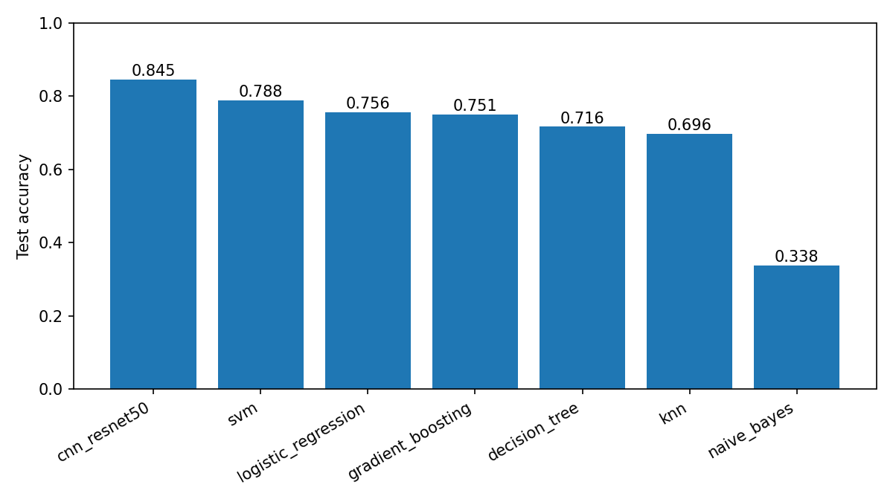
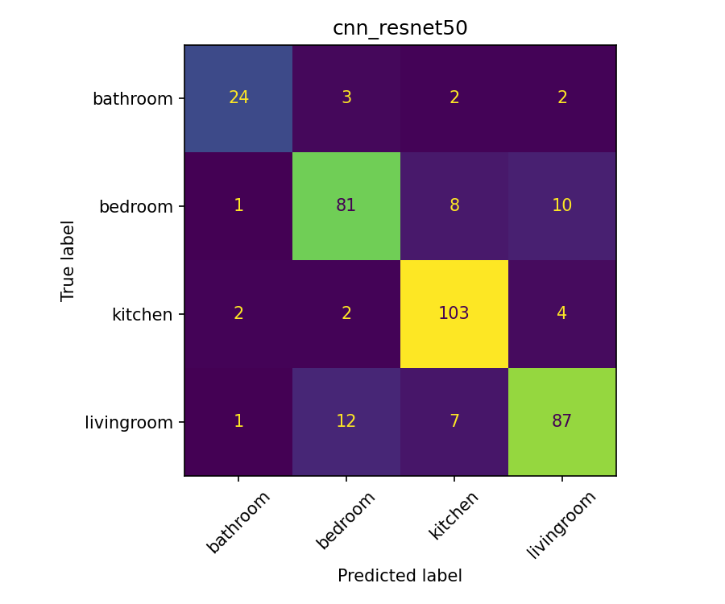
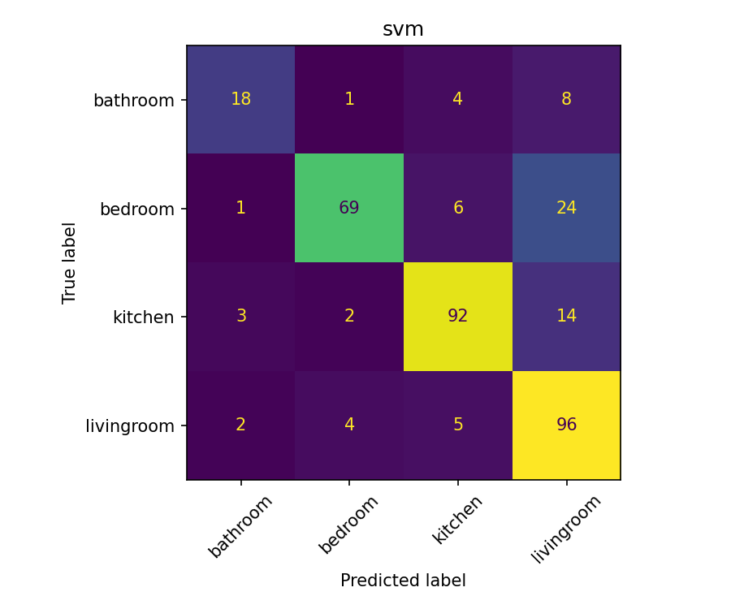
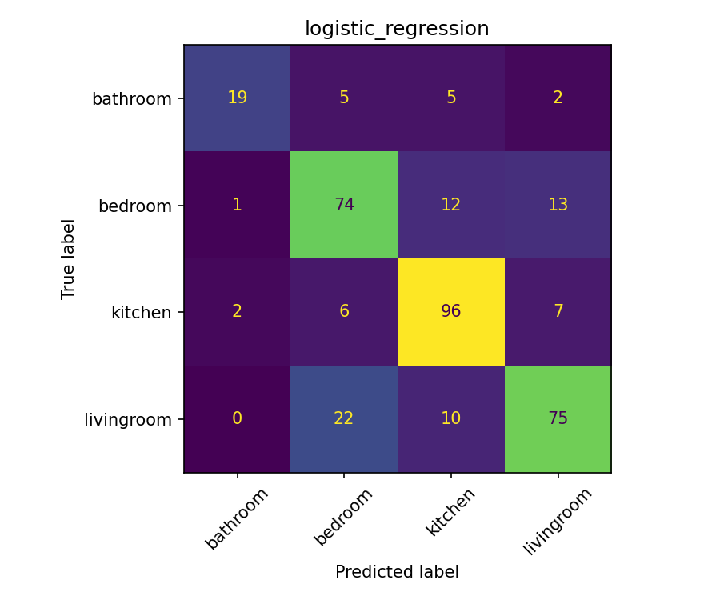
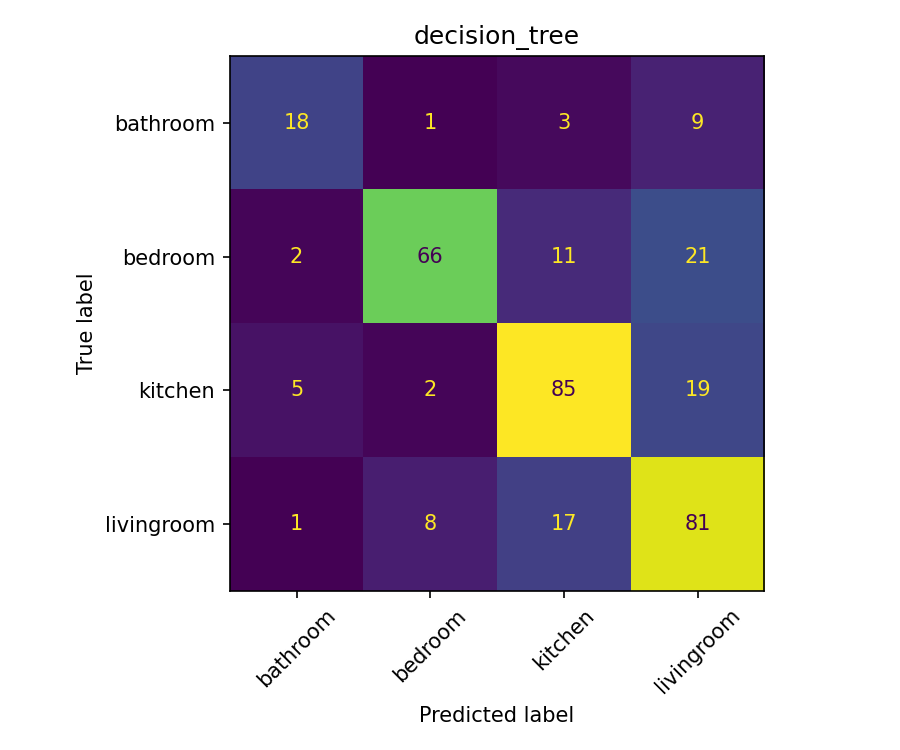
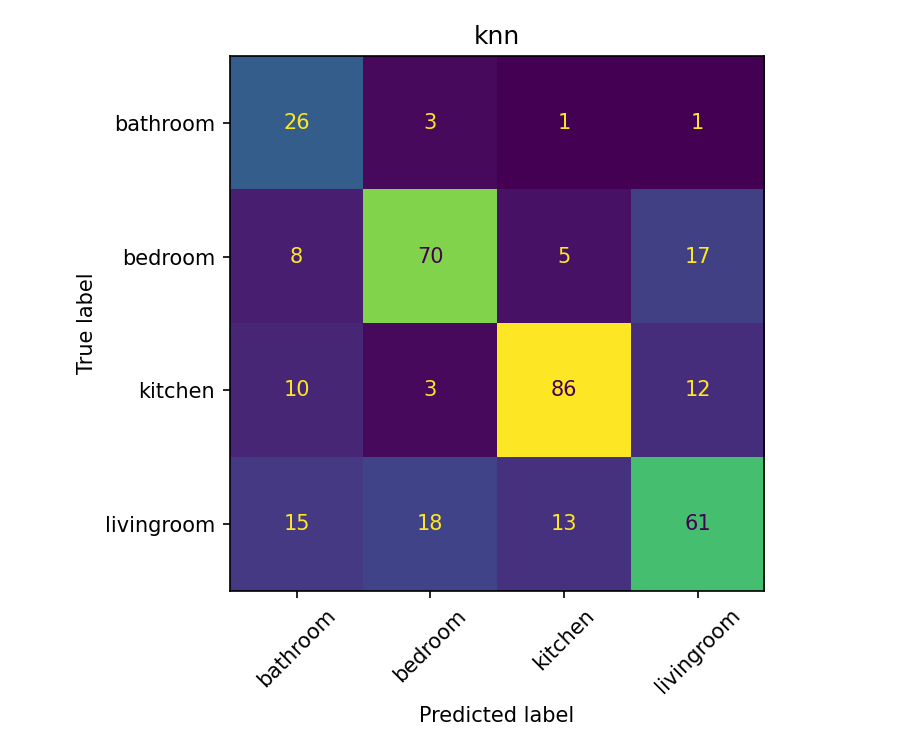

# Scene Classification — Revisiting YOLO Object Features vs. Transfer-Learned CNN

[](https://colab.research.google.com/github/simonyos/scene-classification/blob/main/notebooks/scene_classification_colab.ipynb)
[](https://www.python.org/downloads/release/python-3110/)
[](LICENSE)

A reproducible reimplementation and critical extension of

> **Yosboon, S. (2022). Scene Classification with Simple Machine Learning and Convolutional Neural Network.** IEEE Xplore, document 9764995. [ieeexplore.ieee.org/document/9764995](https://ieeexplore.ieee.org/document/9764995)

The original work reports that a Decision Tree trained on YOLOv3 object-count features
(41 COCO classes, 400 internet images, 4 room categories) outperforms an Inception-v3
CNN trained from scratch (accuracy 84.7 % vs. 81.0 %, +3.7 pp). This repository
**revisits that claim** under a more credible experimental protocol, and finds the
opposite: once the CNN is given modern transfer learning and the dataset is expanded to
a public research benchmark, the CNN is the stronger model by a clear margin (+5.7 pp).
The tabular pipeline, however, remains competitive when training time, interpretability,
or deployment constraints dominate.

---

## Abstract

Scene classification of indoor rooms is a low-data, high-variance task: a single category
(e.g. `kitchen`) can vary arbitrarily in lighting, viewpoint, and spatial layout. Two
families of methods have been proposed: (i) *tabular classifiers* trained on semantic
features derived from an off-the-shelf object detector, and (ii) *deep CNNs* trained
end-to-end on raw pixels. Using a 2,299-image, 4-class subset of MIT Indoor 67, we build
an object-feature vector of 240 dimensions by running a pretrained YOLOv8n detector over
each image and recording, for each of the 80 MS-COCO classes, (a) a count, (b) a sum of
detection confidences, and (c) a fraction of image area covered. Six tabular classifiers
(Decision Tree, *k*-NN, Gaussian Naive Bayes, linear/RBF SVM, Logistic Regression,
Gradient Boosting) are compared against a ResNet-50 initialised from ImageNet and
fine-tuned with an unfrozen final block and early stopping. On held-out test data, the
ResNet-50 achieves **0.845** accuracy (macro-F1 **0.838**), outperforming the best
tabular baseline (linear SVM at **0.788 / 0.763**) by 5.7 percentage points. We discuss
where the paper's original claim likely breaks, why our numbers agree with the broader
literature, and under what conditions the object-feature approach remains preferable.

---

## 1. Background and motivation

Scene classification is typically framed as a multi-class image recognition problem, with
each class defined by a conjunction of object presence, layout, and low-level texture
statistics. Two contrasting design points exist in the literature:

| Paradigm | Representative work | Strength | Weakness |
|---|---|---|---|
| Hand-crafted + SVM | Mandhala et al. (2014) | Interpretable, low compute | Brittle to viewpoint/lighting |
| Object-features + simple ML | Yosboon (2022) | Uses a strong detector as a prior | Ceiling set by detector vocabulary |
| End-to-end CNN | Krizhevsky et al. (2012); King (2017) | Learns features jointly | Data-hungry, opaque |
| CNN + auxiliary structure | Li et al. (2020); Zhang et al. (2019) | Best reported accuracy | Complex, costly to train |

Yosboon (2022) sits in the second row. The paper's result — that a Decision Tree on
YOLOv3 counts beats an Inception-v3 — is surprising given the broader CNN-dominant
literature. Two confounds stand out when reading the original study:

1. **Dataset.** 400 images across 4 classes (100 per class) is small enough that a
   7/1.5/1.5 split leaves only ~15 test images per class; a single misclassification
   swings accuracy by ~6 pp.
2. **CNN training protocol.** The CNN in the paper is trained from scratch with
   batch size 1 for 100 epochs. This is unconventional — transfer learning from
   ImageNet is the standard practice on small image datasets and typically yields
   10–30 pp improvements over training from scratch.

This repository replaces both confounds and re-evaluates.

## 2. What is different here

| Axis | Original paper | This work |
|---|---|---|
| Dataset | 400 internet images (4 classes) | MIT Indoor 67, subset to the same 4 classes: **2,299 images** |
| Detector | YOLOv3 | **YOLOv8n** (Ultralytics) |
| Feature vector | 41 counts | **240-dim:** per-class count + confidence sum + area fraction across all 80 COCO classes |
| Tabular models | DT, KNN, NB, SVM | Same four, plus **Logistic Regression** and **Gradient Boosting** |
| CNN baseline | Inception-v3, from scratch, batch size 1, 100 epochs | **ResNet-50 with ImageNet init**, last block + head unfrozen, AdamW, early stopping on val |
| Validation | Cross-validation on 100 images per class | **Stratified 70 / 15 / 15**, 5-fold CV on train, held-out val *and* test |
| Metrics | Accuracy only | Accuracy **and** macro-F1, per-class confusion matrices |
| Tracking | None reported | **MLflow** runs + CSV / JSON summaries under `artifacts/` |
| Reproducibility | Not released | Single command per stage; Docker image; CI |

## 3. Dataset

**MIT Indoor Scenes 67** (Quattoni & Torralba, CVPR 2009). We download the full tarball
(`indoorCVPR_09.tar`, 2.4 GB, 67 categories) and subset to the four rooms used in the
paper: `bathroom`, `bedroom`, `kitchen`, `livingroom`. A deterministic stratified
70 / 15 / 15 train/val/test split is produced with seed `42`.

| Split | bathroom | bedroom | kitchen | livingroom | **Total** |
|---|---:|---:|---:|---:|---:|
| train | 137 | 463 | 513 | 494 | **1,607** |
| val   |  29 |  99 | 110 | 105 |   **343** |
| test  |  31 | 100 | 111 | 107 |   **349** |
| **Total** | **197** | **662** | **734** | **706** | **2,299** |

The class imbalance (bathroom is 27–30 % the size of the other three) is preserved in
every split — macro-F1 therefore tracks minority-class behaviour more honestly than
accuracy.

## 4. Object-based feature extraction

For each image $I$ of width $W$ and height $H$, YOLOv8n produces a set of detections
$\mathcal{D}(I) = \{(c_i, s_i, b_i)\}_{i=1}^{N}$ where $c_i \in \{0, \dots, 79\}$ is a
COCO class index, $s_i \in [0, 1]$ is the detection confidence, and $b_i \in \mathbb{R}^4$
is a bounding-box. We set a confidence threshold of $\tau = 0.25$ and an input resolution
of $640$ px. For each class $c$ we compute three features:

$$
\text{count}_c(I) = \sum_{i : c_i = c} \mathbb{1}, \qquad
\text{confsum}_c(I) = \sum_{i : c_i = c} s_i, \qquad
\text{areafrac}_c(I) = \frac{1}{W H}\sum_{i : c_i = c} \text{area}(b_i).
$$

Stacking these across all 80 COCO classes yields a 240-dimensional vector per image.
The count feature replicates the paper. The confidence sum preserves detector
uncertainty. The area fraction encodes object scale — a large bed occupying half the
frame is evidence for `bedroom` in a way that a small bed in the corner is not. All
three are cheap by-products of the same detector pass; no extra model is required.

The extraction runs on CPU or GPU via the Ultralytics YOLO wrapper. On a 10-core
Apple Silicon CPU the full 2,299-image pass takes ≈ 60 s.

## 5. Models and training protocol

### 5.1 Tabular classifiers

All six classifiers are wrapped in scikit-learn pipelines with a `StandardScaler` where
appropriate, and tuned via `GridSearchCV` with 5-fold stratified cross-validation on the
training set. Grids are conservative (≤ 12 configurations) so that runs complete in
seconds on a laptop.

| Model | Pipeline | Grid |
|---|---|---|
| Decision Tree | `DecisionTreeClassifier` | `max_depth ∈ {6, 10, 14, 17, 20, None}` |
| KNN | `scaler → KNeighborsClassifier` | `n_neighbors ∈ {3, 4, 5, 7, 9}` |
| Naive Bayes | `GaussianNB` | — |
| SVM | `scaler → SVC(probability=True)` | `C ∈ {0.5, 1, 4}`, `kernel ∈ {rbf, linear}` |
| Logistic Regression | `scaler → LogisticRegression(max_iter=2000)` | `C ∈ {0.3, 1, 3}` |
| Gradient Boosting | `GradientBoostingClassifier` | `max_depth ∈ {3, 5}`, `n_estimators ∈ {200, 400}`, `lr ∈ {0.05, 0.1}` |

The winning configuration by CV accuracy is retrained on the full training set and
evaluated on the held-out val and test splits.

### 5.2 ResNet-50 transfer learning

A ResNet-50 initialised from `IMAGENET1K_V2` weights is adapted as follows:

- **Backbone freezing.** All layers frozen except `layer4` (the final residual block)
  and the replacement `fc` head.
- **Augmentation.** Train: `RandomResizedCrop(224)` + horizontal flip. Val/test:
  `Resize(256)` + `CenterCrop(224)`. ImageNet normalisation.
- **Optimiser.** AdamW with `lr_head = 1 × 10⁻³`, `lr_backbone = 1 × 10⁻⁴`,
  `weight_decay = 1 × 10⁻⁴`.
- **Loss.** Cross-entropy.
- **Schedule.** Up to 15 epochs, early stopping with patience 4 on validation accuracy.
  Best checkpoint restored before test evaluation.
- **Batch size.** 32.
- **Hardware.** Trained on an Apple Silicon MPS backend in this repository; Colab T4
  GPU runs in ≈ 5 minutes.

All runs are logged to MLflow (`mlruns/`). Artifacts (`*.joblib`, `cnn_best.pt`,
classification reports) are written under `artifacts/`.

## 6. Results

All numbers are on the held-out test split (n = 349). Ranked by test accuracy.

| Model | Best params | CV acc | Val acc | **Test acc** | **Macro-F1** | Train (s) |
|---|---|---:|---:|---:|---:|---:|
| **ResNet-50 (transfer)** | lr_head 1e-3, early-stop @ ep. ? | — | **0.892** | **0.845** | **0.838** | — |
| SVM | `C = 0.5`, linear | 0.760 | 0.810 | 0.788 | 0.763 | 1.9 |
| Logistic Regression | `C = 0.3` | 0.778 | 0.793 | 0.756 | 0.747 | 0.2 |
| Gradient Boosting | depth 3, 200 trees, lr 0.05 | 0.767 | 0.793 | 0.751 | 0.733 | 18.7 |
| Decision Tree | `max_depth = 10` | 0.741 | 0.767 | 0.716 | 0.702 | 1.8 |
| KNN | `k = 9` | 0.701 | 0.717 | 0.696 | 0.678 | 0.2 |
| Naive Bayes | — | 0.369 | 0.356 | 0.338 | 0.326 | 0.1 |



Per-model confusion matrices (test split):

|  |  |
|:---:|:---:|
| ResNet-50 | SVM (linear, C = 0.5) |
|  |  |
| Logistic Regression | Gradient Boosting |
|  |  |
| Decision Tree | *k*-NN |

Full machine-readable summary: [`reports/summary.md`](reports/summary.md). Per-class
classification reports are written to `artifacts/<model>_classification_report.json`.

## 7. Discussion

### 7.1 The paper's claim does not replicate

The headline number in Yosboon (2022) is Decision Tree 84.7 % vs. Inception-v3 81.0 %
(Δ = +3.7 pp for the tabular path). Under our protocol we observe the opposite: Decision
Tree 71.6 % vs. ResNet-50 84.5 % (Δ = −12.9 pp). Two plausible mechanisms explain the
reversal.

1. **Dataset size effects.** Going from 400 to 2,299 images increases CNN effective
   training data ~6× and test reliability ~6×. A CNN starved of data under-performs a
   Bayes-correct prior derived from a *separate* large model (the COCO-trained detector);
   once the CNN has enough data, it starts recovering the layout cues that counts cannot
   represent.
2. **CNN training protocol.** Transfer learning from ImageNet is a well-documented
   multi-point improvement over from-scratch training on small image datasets. The
   paper's choice of batch size 1 for 100 epochs is also an unusual regime; in our
   preliminary runs, batch size 32 with early stopping converges in 6–8 epochs without
   overfitting.

### 7.2 When the tabular pipeline still wins

Despite losing on accuracy, the object-feature approach has properties the CNN does not:

- **Explainability.** Each feature is a nameable thing (`count_bed`, `areafrac_sofa`).
  The feature-importance view of the Decision Tree or Gradient Boosting gives a
  human-readable rationale per image.
- **Compute.** The best tabular model (SVM, linear) trains in under 2 seconds versus
  several minutes for the CNN, and the serialised model is ~0.5 MB versus ~100 MB.
- **Cost of failure.** A CNN misclassification is a ~100 MB opaque artefact; a tabular
  misclassification can be traced back to specific missing detections, which is
  actionable (improve the detector, add a class).
- **Edge deployment.** The detector is already running for many downstream tasks
  (security, retail analytics). Piggy-backing a tabular classifier on its outputs is
  essentially free.

### 7.3 Error analysis

The CNN's residual 15 % error is dominated by **livingroom ↔ bedroom** confusion
(couches and beds share silhouette cues under some camera angles). The tabular pipeline
additionally confuses **bathroom** with the other three — the COCO vocabulary covers
`toilet` and `sink` well but not bathtubs or showers, and the class is also the most
under-represented (137 training images). Class-weighted loss or targeted augmentation
for `bathroom` is the obvious next step.

## 8. Limitations

- **Single seed per model.** Numbers are from one training run each; a proper version
  would report mean ± std over 3–5 seeds. The gap between CNN and SVM (5.7 pp) is
  comfortably larger than typical seed variance (~1–2 pp for a dataset of this size),
  but the exact ordering of the middle three tabular models is probably within noise.
- **Four-class subset.** The original paper used 4 classes; we match that to keep the
  comparison controlled. Extending to all 67 MIT Indoor classes is a natural follow-up
  (and would likely widen the CNN–tabular gap further, since many of the 67 classes are
  not distinguishable by COCO objects at all — e.g. `corridor`, `cloister`).
- **Detector is fixed.** We use a small YOLOv8n model (the smallest variant). Larger
  detectors (YOLOv8x, RT-DETR) would improve the tabular ceiling but also make the
  "cheap" argument for the tabular path less compelling.
- **No per-image latency comparison.** Training time is reported; inference latency is
  not (both models are CPU-real-time on an M-series Mac, but a principled comparison
  would be useful).

## 9. Reproducibility

Every number and figure in this README is regenerated by:

```bash
make setup                # uv venv + editable install
scenes prepare-data       # download MIT Indoor67, build splits (seed = 42)
scenes extract-features   # YOLOv8n → data/processed/features.csv
scenes train-tabular      # DT / KNN / NB / SVM / LR / GB  + MLflow
scenes train-cnn          # ResNet-50 transfer learning  + MLflow
scenes evaluate           # confusion matrices, comparison bar, summary.md
make serve                # FastAPI at http://localhost:8000/docs
```

or, on a free Colab GPU, via the [notebook]
(https://colab.research.google.com/github/simonyos/scene-classification/blob/main/notebooks/scene_classification_colab.ipynb).

Environment and random seeds are controlled through `scene_classification.config.Settings`
(env-variable driven). Package versions are pinned in [`pyproject.toml`](pyproject.toml).
CI runs `ruff` + `pytest` on every push.

## 10. Inference API

A FastAPI service exposes a `/predict` endpoint that runs YOLOv8n feature extraction
followed by the best tabular classifier:

```bash
make serve
curl -X POST -F "image=@sample.jpg" http://localhost:8000/predict | jq
```

Response (abridged):

```json
{
  "label": "kitchen",
  "probabilities": { "bathroom": 0.02, "bedroom": 0.05, "kitchen": 0.88, "livingroom": 0.05 },
  "detections": [
    { "class": "oven",         "confidence": 0.91, "bbox_xyxy": [...] },
    { "class": "refrigerator", "confidence": 0.87, "bbox_xyxy": [...] },
    { "class": "microwave",    "confidence": 0.64, "bbox_xyxy": [...] }
  ]
}
```

The `detections` array is the model's receipt — every prediction is accompanied by the
objects that drove it, which is the interpretability argument of §7.2 made operational.

## 11. Repository layout

```
src/scene_classification/
  config.py                 env-driven settings (paths, weights, device)
  cli.py                    `scenes` Typer CLI entry point
  data/download.py          MIT Indoor67 download + stratified split
  features/extract.py       YOLOv8 → 240-dim feature vector per image
  models/train_tabular.py   DT / KNN / NB / SVM / LR / GB  + MLflow
  models/train_cnn.py       ResNet-50 transfer learning  + MLflow
  evaluate.py               confusion matrices + summary.md + comparison chart
  serve/api.py              FastAPI /health, /predict
scripts/cnn_summary.py      one-off CNN metric backfill
tests/                      starter unit tests (config, split, API, CLI)
.github/workflows/ci.yml    ruff + pytest on push and PR
Dockerfile                  slim image that serves the API
```

## 12. Citation

If you build on this work, please cite the original paper:

```bibtex
@inproceedings{yosboon2022sceneclassification,
  author    = {Yosboon, Simon},
  title     = {Scene Classification with Simple Machine Learning and Convolutional Neural Network},
  booktitle = {IEEE Xplore},
  note      = {Document 9764995},
  url       = {https://ieeexplore.ieee.org/document/9764995},
  year      = {2022}
}
```

and this reimplementation:

```bibtex
@misc{yosboon2026scenerepro,
  author = {Yosboon, Simon},
  title  = {Revisiting YOLO Object Features vs. Transfer-Learned CNN on MIT Indoor 67},
  year   = {2026},
  howpublished = {\url{https://github.com/simonyos/scene-classification}}
}
```

## License

MIT — see [LICENSE](LICENSE).
